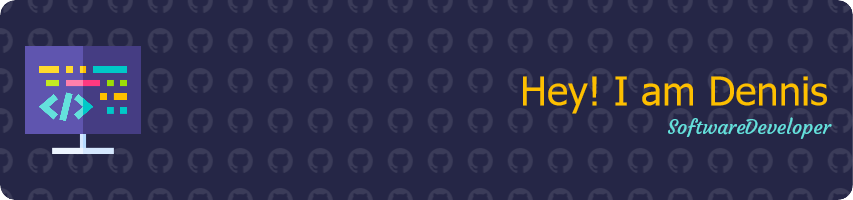

## Hi there, I'm Dennis Khor 👋

### About Me

- 🛠️ I’m currently working on a cross-platform shopping list app using React Native, Expo, and Tamagui.
- 🌱 I’m currently learning advanced Firebase features and Stripe integration.
- 💬 Ask me about front-end development, JavaScript, React.js, Vue.js, and integrating payment methods.
- 👨‍💻 I'm a software developer based in Sydney, Australia with experience in e-commerce, travel agencies, and insurance projects.
- 📫 How to reach me: denniskcc@hotmail.com
- 😄 Pronouns: he/him
- 👨‍👩‍👧‍👦 I have a newborn daughter and an older son.
- 🚴 I enjoy cycling and often go for long rides on weekends.

### Technologies & Tools

### GitHub Stats

### Projects

- [Shopping List App](https://github.com/imtripleq/easy-shoppinglist) - A cross-platform shopping list app with features like predictive text input, bullet listing, tick/untick items, group items, offline functionality, and more.
- [Web Portfolio](https://github.com/imtripleq/react_portfolio_mui) - Built in 2021, might give it a refresh anytime soon!
- [Nextjs + Strapi](https://github.com/imtripleq/dennis-strapi-nextjs-tailwind) - Nextjs project using boilerplate to quickly set up Strapi

### Connect with Me

